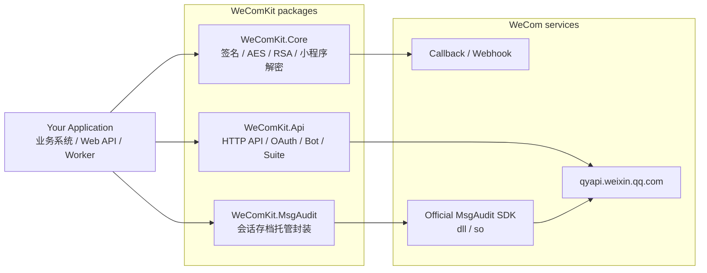
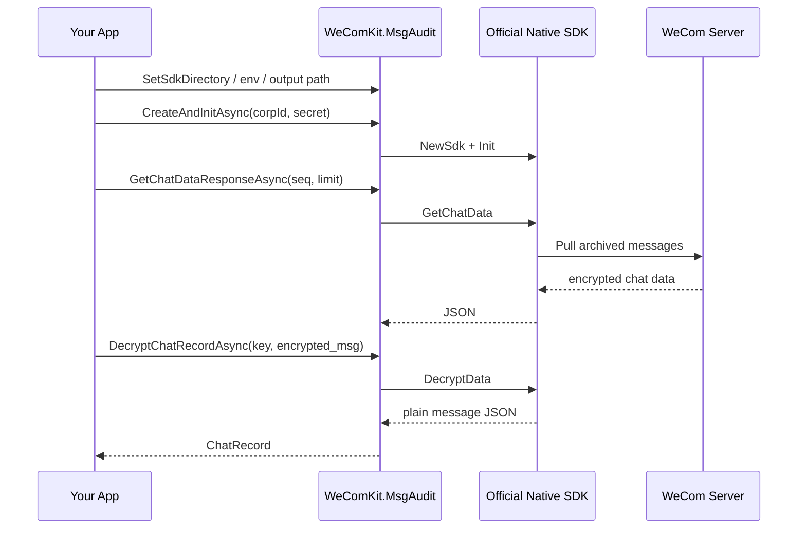
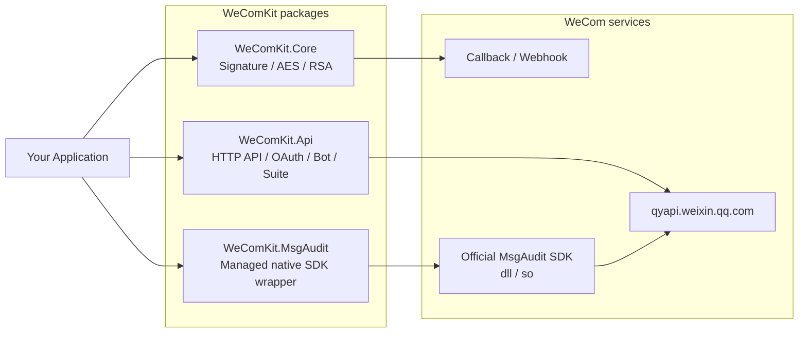

# WeComKit

[](https://github.com/castorhrio/WeComKit/actions/workflows/ci.yml)
[](LICENSE)
[](https://dotnet.microsoft.com/)

中文 | [English](#english)

WeComKit 是一个面向 .NET 8 的企业微信（WeCom / WeChat Work）集成工具库。它把企业微信对接中常见但容易写错的基础协议、HTTP API、群机器人、第三方应用授权和会话存档官方 SDK 封装成可独立引用的 NuGet 包。

这个项目的目标不是绑定某个业务系统，而是提供稳定、清晰、可组合的基础封装，让应用层可以专注处理自己的用户、订单、审批、消息归档或内部流程。

## 项目定位

企业微信官方文档覆盖面很广，但真实项目里通常会反复遇到这些问题：

- 回调签名、AES 解密、CorpId / AppId 校验容易写错。
- AccessToken 缓存、过期刷新、错误码处理容易分散在业务代码里。
- 自建应用、OAuth、通讯录、素材、应用消息、群机器人、第三方应用 suite 授权接口重复封装成本高。
- 会话存档官方 SDK 只提供 native dll / so，Windows 和 Linux 部署方式不同，.NET 项目需要额外处理加载、诊断和线程安全。

WeComKit 将这些通用问题封装在基础库中，同时明确不包含业务系统逻辑。

## 包结构

| 包 | 说明 | 适用场景 |
| --- | --- | --- |
| `WeComKit.Core` | 回调签名验证、消息加解密、RSA 解密、小程序数据解密 | Webhook 回调、会话存档密钥解密、微信小程序数据解密 |
| `WeComKit.Api` | 企业微信 HTTP API 客户端 | AccessToken、OAuth、通讯录、素材、应用消息、群机器人、第三方应用 suite 授权 |
| `WeComKit.MsgAudit` | 企业微信会话存档官方 native SDK 的托管封装 | 拉取会话消息、解密消息、下载媒体文件、native SDK 诊断 |

## 架构



### 设计边界

WeComKit 只处理企业微信集成的基础能力：

- 协议层：签名、AES 加解密、RSA 解密、微信小程序 encryptedData 解密。
- API 层：HTTP 调用、AccessToken 缓存、token 失效自动刷新重试、官方响应模型。
- SDK 层：会话存档 native SDK 加载、诊断、线程安全封装、消息拉取和媒体下载。

这些内容不会进入通用库：

- 订单导入、客户匹配、渠道匹配、Excel 模板识别。
- OSS、数据库实体、业务状态流转、定时任务。
- 吉客云或任何特定 ERP / OMS / WMS 对接。
- 会话存档消息的业务消费流程。

应用层应该自己决定消息如何入库、如何匹配业务对象、如何触发后续流程。

## 功能矩阵

| 能力 | `Core` | `Api` | `MsgAudit` |
| --- | ---: | ---: | ---: |
| 回调签名验证 | yes |  |  |
| 企业微信 / 微信公众号消息加解密 | yes |  |  |
| RSA 解密 `encrypt_random_key` | yes |  | yes |
| 小程序 encryptedData 解密 | yes |  |  |
| AccessToken 获取、缓存、失效重试 |  | yes |  |
| 通讯录部门 / 成员 API |  | yes |  |
| 素材上传 |  | yes |  |
| 应用消息发送 |  | yes |  |
| OAuth 网页授权 |  | yes |  |
| 群机器人 webhook / response_url |  | yes |  |
| 第三方应用 suite 授权 |  | yes |  |
| 会话存档消息拉取 |  |  | yes |
| 会话存档消息解密 | yes |  | yes |
| 会话存档媒体下载 |  |  | yes |
| native SDK 文件发现和加载诊断 |  |  | yes |

## 安装

按需安装即可：

```powershell
dotnet add package WeComKit.Core --version 1.0.0
dotnet add package WeComKit.Api --version 1.0.0
dotnet add package WeComKit.MsgAudit --version 1.0.0
```

`WeComKit.Api` 和 `WeComKit.MsgAudit` 会自动引用 `WeComKit.Core`。

## 快速开始

### 回调消息验签和解密

```csharp
using WeComKit.Core;

var crypt = new WeComMessageCrypt(token, encodingAesKey, corpId);

var plainXml = crypt.VerifyAndDecrypt(
    msgSignature,
    timestamp,
    nonce,
    encrypted);
```

如果是企业微信机器人回调，`receiveid` 可能为空。此时构造 `WeComMessageCrypt` 时可以传入空字符串，避免 CorpId 尾部校验失败。

### 自建应用 API

```csharp
using WeComKit.Api.Extensions;

services.AddWeComKit(options =>
{
    options.CorpId = "your-corp-id";
    options.AgentId = "1000002";
    options.Secret = "your-app-secret";
});
```

发送文本消息：

```csharp
using WeComKit.Api;
using WeComKit.Api.Models;

public sealed class NoticeService
{
    private readonly WeComMessageApi _messages;

    public NoticeService(WeComMessageApi messages)
    {
        _messages = messages;
    }

    public Task SendAsync(string userId, string content, CancellationToken ct)
    {
        return _messages.SendTextAsync(new TextMessageRequest
        {
            ToUser = userId,
            Text = new TextMessage { Content = content }
        }, ct);
    }
}
```

`WeComHttpClient` 内置 AccessToken 缓存。遇到常见 token 失效错误码时会清理缓存并自动重试一次。

### OAuth 网页授权

```csharp
var authUrl = oauthApi.BuildAuthorizeUrl(
    "https://example.com/wecom/callback",
    state: "state");

var identity = await oauthApi.GetUserInfoAsync(code, ct);

if (!string.IsNullOrEmpty(identity.UserTicket))
{
    var detail = await oauthApi.GetUserDetailAsync(identity.UserTicket, ct);
}
```

### 群机器人

```csharp
await botApi.SendWebhookMarkdownAsync("**Build completed**", ct);
await botApi.SendResponseTextAsync(responseUrl, "收到消息", ct: ct);
```

### 第三方应用 suite 授权

```csharp
var suiteToken = await suiteApi.GetSuiteTokenAsync(suiteTicket, ct);
var preAuth = await suiteApi.GetPreAuthCodeAsync(suiteToken.SuiteAccessToken, ct);
var permanent = await suiteApi.GetPermanentCodeAsync(suiteToken.SuiteAccessToken, authCode, ct);
var corpToken = await suiteApi.GetCorpTokenAsync(
    suiteToken.SuiteAccessToken,
    permanent.AuthCorpInfo!.CorpId,
    permanent.PermanentCode,
    ct);
```

`suite_ticket`、`permanent_code` 和授权企业 token 的持久化策略差异很大，WeComKit 只封装官方 API，不内置数据库存储。

## 会话存档

`WeComKit.MsgAudit` 是企业微信会话存档官方 native SDK 的托管封装。它不会重新分发官方 dll / so，也不会在运行时自动下载 SDK。



### native SDK 路径配置

任选一种方式：

- 环境变量 `WECOM_MSG_AUDIT_SDK_DIR`
- `WeComFinanceSdk.SetSdkDirectory(path)`
- 将官方 native 文件复制到应用输出目录
- MSBuild 属性 `WeComMsgAuditSdkPath` + `WeComMsgAuditCopySdkFiles=true`

```xml
<PropertyGroup>
  <WeComMsgAuditSdkPath>C:\wecom-msg-audit-sdk</WeComMsgAuditSdkPath>
  <WeComMsgAuditCopySdkFiles>true</WeComMsgAuditCopySdkFiles>
</PropertyGroup>
```

MSBuild 自动复制默认关闭，避免 NuGet 包对消费项目产生隐式构建副作用。

### Windows / Linux 文件说明

Windows 通常需要把这些文件放在同一目录：

- `WeWorkFinanceSdk.dll`
- `libcrypto-3-x64.dll`
- `libssl-3-x64.dll`
- `libcurl-x64.dll`

Linux 至少需要：

- `libWeWorkFinanceSdk.so`

Linux 还需要确保 OpenSSL / curl 等系统依赖能被动态链接器找到。部署前建议执行：

```bash
ldd libWeWorkFinanceSdk.so
```

### 诊断

```csharp
var availability = WeComFinanceSdk.CheckAvailability();
var nativeLoad = WeComFinanceSdk.DiagnoseNativeLoad();
var full = WeComFinanceSdk.Diagnose(corpId, secret);
```

`DiagnoseNativeLoad` 只检查文件发现和动态库加载，不需要企业微信凭据。`Diagnose` 会调用 native SDK 和企业微信服务，适合安装配置检查，不适合作为高频健康检查。

## 仓库结构

```text
WeComKit/
  src/
    WeComKit.Core/
    WeComKit.Api/
    WeComKit.MsgAudit/
  tests/
    WeComKit.Tests/
  .github/workflows/
    ci.yml
```

## 本地构建

```powershell
dotnet restore .\WeComKit.sln
dotnet test .\WeComKit.sln -c Release
dotnet pack .\WeComKit.sln -c Release --no-build -o .\artifacts\packages
```

## 版本策略

WeComKit 遵循语义化版本控制：

- `1.x`：保持公开 API 兼容，允许增加 API、DTO 可选字段和诊断能力。
- `2.0`：用于破坏性公开 API 变更。

## 贡献

欢迎提交 issue 和 pull request。建议贡献前先阅读：

- [CONTRIBUTING.md](CONTRIBUTING.md)
- [SECURITY.md](SECURITY.md)
- [CHANGELOG.md](CHANGELOG.md)

## 许可证

本项目使用 [MIT License](LICENSE)。

企业微信会话存档 native SDK 由腾讯通过企业微信管理后台分发，本仓库不重新分发这些原生二进制文件。使用方需要自行从官方渠道下载，并遵守腾讯相关条款。

---

## English

WeComKit is a .NET 8 toolkit for WeCom / WeChat Work integrations. It packages protocol helpers, common HTTP APIs, bot webhook support, third-party suite authorization, and a managed wrapper for the official message-audit native SDK into separate NuGet packages.

The project focuses on reusable infrastructure. It does not include business-specific logic such as order import, customer mapping, ERP integration, OSS storage, scheduled jobs, or message archive workflows.

## Packages

| Package | Description | Typical usage |
| --- | --- | --- |
| `WeComKit.Core` | Signature verification, message encryption/decryption, RSA helper, mini-program data decryption | Callback handlers, message-audit key decryption, mini-program encrypted data |
| `WeComKit.Api` | Managed WeCom HTTP API clients | AccessToken, OAuth, contacts, media, app messages, bot webhook, third-party suite authorization |
| `WeComKit.MsgAudit` | Managed wrapper around the official message-audit native SDK | Pull archived messages, decrypt records, download media files, diagnose native SDK loading |

## Architecture



## Installation

Install only what you need:

```powershell
dotnet add package WeComKit.Core --version 1.0.0
dotnet add package WeComKit.Api --version 1.0.0
dotnet add package WeComKit.MsgAudit --version 1.0.0
```

`WeComKit.Api` and `WeComKit.MsgAudit` reference `WeComKit.Core` automatically.

## Quick Start

### Callback decryption

```csharp
using WeComKit.Core;

var crypt = new WeComMessageCrypt(token, encodingAesKey, corpId);
var plainXml = crypt.VerifyAndDecrypt(msgSignature, timestamp, nonce, encrypted);
```

### App API

```csharp
using WeComKit.Api.Extensions;

services.AddWeComKit(options =>
{
    options.CorpId = "your-corp-id";
    options.AgentId = "1000002";
    options.Secret = "your-app-secret";
});
```

```csharp
await messages.SendTextAsync(new TextMessageRequest
{
    ToUser = "user-id",
    Text = new TextMessage { Content = "Hello from WeComKit" }
}, ct);
```

The HTTP client caches AccessToken values and retries once when common token-expired error codes are returned.

### Message audit

`WeComKit.MsgAudit` does not ship or download Tencent's native SDK binaries. Download the message-audit SDK from the WeCom admin console and configure the path explicitly:

```csharp
using WeComKit.MsgAudit;

WeComFinanceSdk.SetSdkDirectory(@"C:\wecom-msg-audit-sdk");

var nativeLoad = WeComFinanceSdk.DiagnoseNativeLoad();

await using var sdk = await WeComFinanceSdk.CreateAndInitAsync(corpId, secret);
var response = await sdk.GetChatDataResponseAsync(seq: 0, limit: 100);
```

On Windows, keep `WeWorkFinanceSdk.dll`, `libcrypto-3-x64.dll`, `libssl-3-x64.dll`, and `libcurl-x64.dll` in the same directory. On Linux, deploy at least `libWeWorkFinanceSdk.so` and make sure its OpenSSL / curl dependencies are discoverable by the dynamic linker.

## Build

```powershell
dotnet restore .\WeComKit.sln
dotnet test .\WeComKit.sln -c Release
dotnet pack .\WeComKit.sln -c Release --no-build -o .\artifacts\packages
```

## License

This project is licensed under the [MIT License](LICENSE).

The official WeCom message-audit native SDK is distributed by Tencent through the WeCom admin console. This repository does not redistribute those native binaries.
